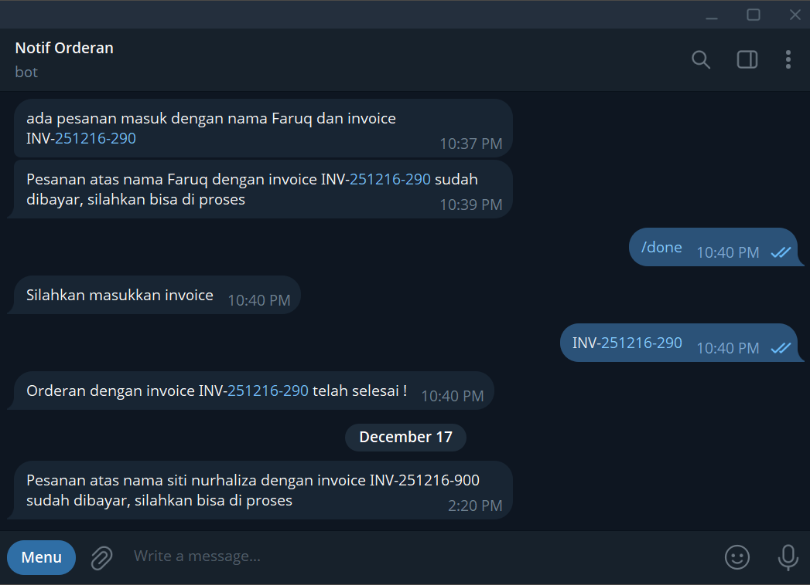
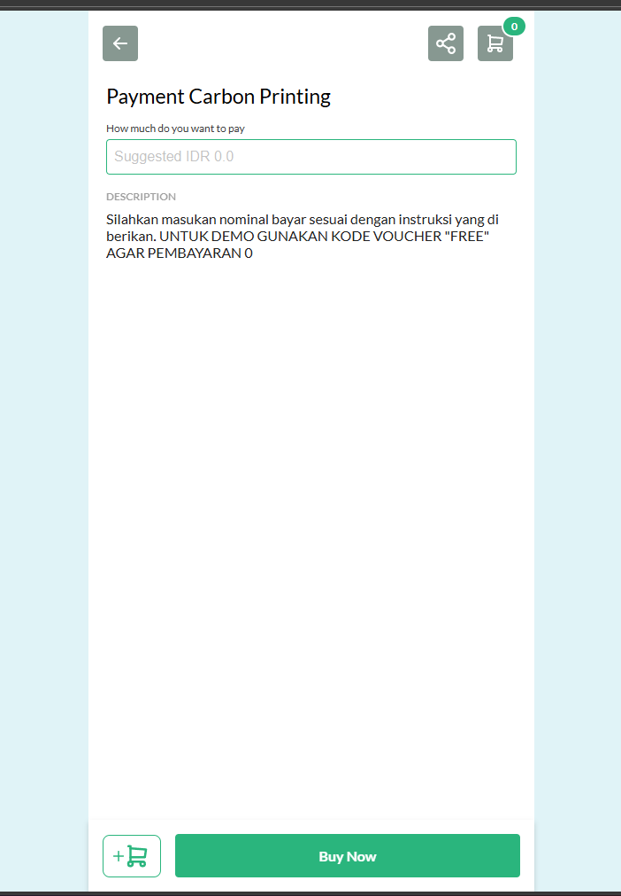
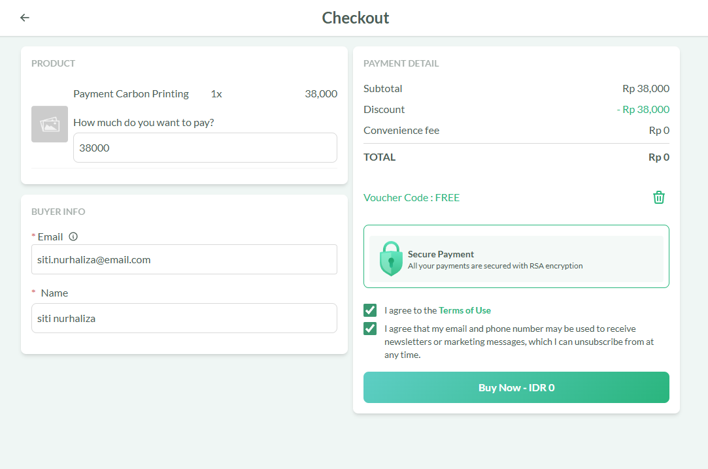
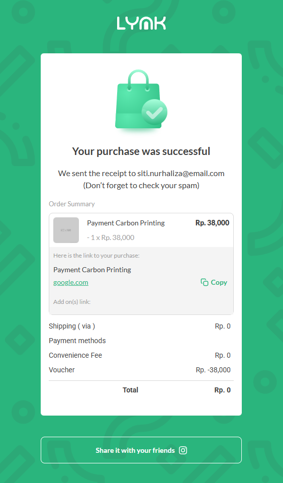

# AI-OrderPay-Assistant: End-to-End Order & Payment Automation dengan n8n

**[WARNING] !!! Gunakan data dummy jika ingin mencoba**  
**Demo**: https://carbonprinting.vercel.app/  
**Google Sheet**: https://docs.google.com/spreadsheets/d/11b_ORLeM_Rx8eA9wp6L9DuW3-6V3cLBkJ9_Bs8atBm0/edit?usp=sharing  
**Google Drive**: https://drive.google.com/drive/folders/1kG9ya1mytrXVQiaPpzvhDOXEMGltJUEC?usp=sharing

Proyek ini adalah demonstrasi sistem otomasi cerdas yang menangani siklus pesanan (*Order Fulfillment*), mulai dari penerimaan order, manajemen pembayaran, hingga pelaporan. Menggunakan **n8n** sebagai otak utama, sistem ini menggabungkan AI untuk pembacaan data tidak terstruktur dan kriptografi untuk keamanan pembayaran.

Sistem ini dirancang untuk memberikan solusi 'Autopilot' untuk bisnis dari mulai menyelesaikan masalah "human error" dalam penghitungan harga, pencatatan pesanan manual, hingga menutup celah keamanan dalam verifikasi bukti bayar.

## 📜 Konsep Proyek

Tujuan utama proyek ini adalah mengotomasi pekerjaan administratif manual dan menciptakan alur kerja yang *seamless*. Alur kerjanya adalah sebagai berikut:

1.  **Multi-Channel Ingestion**: 
    *   **Via Web**: Data terstruktur (form order) masuk melalui Webhook.
    *   **Via Email**: Menggunakan **Google Gemini (AI)** untuk membaca email pesanan yang tidak terstruktur, mengekstrak data (Nama, Ukuran, Jumlah), dan mengubahnya menjadi data JSON yang siap olah.
2.  **Smart Processing (Logic & Calculation)**:
    *   Sistem menghitung total harga secara otomatis menggunakan algoritma JavaScript berdasarkan variabel dinamis (misal: ukuran A4, A3, A2, 1M) dan kuantitas.
    *   Pembuatan ID Invoice unik secara otomatis untuk pelacakan.
3.  **File & Database Management**:
    *   File aset/desain dari pelanggan otomatis diunggah dan diorganisir ke folder **Google Drive**.
    *   Seluruh data transaksi dicatat secara real-time ke **Google Sheets**.
4.  **Secure Payment Verification**:
    *   Mengamankan transaksi dengan memvalidasi *Signature* (SHA256) dari penyedia layanan pembayaran (Lynk.id) untuk mencegah manipulasi data pembayaran (Anti-Fraud).
5.  **Real-time Notification & Reporting**:
    *   Notifikasi otomatis ke pelanggan via Telegram saat pembayaran diterima (Lunas) dan saat pesanan selesai.
    *   Laporan performa/omzet harian dikirim otomatis ke Telegram Owner/Manajer.

## 📈 Dampak & Potensi Penghematan

Dengan mengotomatisasi alur pesanan dan pembayaran, **AI-OrderPay-Assistant** menawarkan efisiensi operasional yang signifikan.

### Penghematan Waktu & Akurasi

Estimasi pengurangan beban kerja admin mencapai **90%** per siklus pesanan.

| Tugas Manual Tradisional | Otomatisasi dengan AI-OrderPay-Assistant |
| :--- | :--- |
| Membaca email & download lampiran manual | **AI (Gemini)** mengekstrak data & Auto-upload ke Drive. |
| Menghitung harga total & membuat invoice | **Algoritma JS** menghitung harga instan & generate Invoice ID. |
| Cek mutasi bank/bukti transfer manual | **SHA256 Verification** memvalidasi status pembayaran otomatis. |
| Update status & chat pelanggan manual | Notifikasi Telegram terkirim otomatis saat status berubah. |
| Rekap laporan harian manual | Laporan omzet harian terkirim otomatis tiap malam. |

### Keamanan Transaksi (Security)

Salah satu fitur unggulan proyek ini adalah keamanan. Alih-alih hanya menerima webhook pembayaran secara mentah, sistem melakukan:
*   **Hash Validation**: Membuat string signature lokal dan membandingkannya dengan header `x-lynk-signature` untuk memastikan request benar-benar berasal dari Payment Gateway resmi.

## 🖼️ Visualisasi Alur Kerja

Berikut adalah gambaran visual dari komponen utama dalam sistem ini.

### 1. Order Management & AI Parsing
Workflow ini menangani pesanan masuk. Jika dari email, AI (Gemini) akan membaca isi email tersebut untuk mengambil data detail pesanan.

 
*(Screenshot workflow order management)*

---

### 2. Payment Gateway Verification
Workflow yang berfokus pada keamanan. Menggunakan node Crypto untuk validasi pembayaran sebelum mengubah status pesanan menjadi "Processing".

*(Screenshot workflow Payment gateway)*

---

### 3. Database & File Organization
Data tersusun rapi di Google Sheets dan file desain tersimpan di Google Drive.

*(Screenshot Google Sheet)*

---

*(Screenshot Google Drive)*

---

### 4. Bot Interaksi & Laporan
Bot interaksi terdiri dari 2, yang pertama notif orderan. Bot ini untuk internal karyawan yang berfungsi menerima notif apabila ada orderan yang masuk dan karyawan bisa mengetik `/done` di Telegram untuk menyelesaikan pesanan. Bot yang kedua yaitu admin yang berfungsi mengirim notif ke pemesan apabila pembayaran sudah diterima dan pesanan sudah selesai dan siap diambil.

  
*(Screenshot interaksi Telegram)*

---

*(Screenshot interaksi Telegram)*

---

### 5. Integrasi ke Website
Workflow ini diintegrasikan kedalam website menggunakan webhook, selain dapat menerima orderan melalui form website tersebut juga dapat melakukan pembayaran melalui lynk.id. Selain itu juga pada web tersebut dapat melacak status orderan dengan mengisi no invoice yang didapat dari notifikasi.

  
*(Screenshot form order di web)*

---

  
*(Screenshot lacak orderan)*

---

  
*(Screenshot proses pembayaran)*

---

## ✨ Fitur Demonstrasi

*   **AI-Powered Parser**: Mengubah teks email bebas menjadi data terstruktur JSON.
*   **Dynamic Pricing Engine**: Script JavaScript kustom untuk penentuan harga fleksibel.
*   **Cryptographic Validation**: Keamanan tingkat tinggi untuk webhook pembayaran.
*   **Interactive Admin Bot**: Manajemen status pesanan melalui perintah chat Telegram (ChatOps).
*   **Daily Analytics**: Agregasi data harian untuk laporan bisnis otomatis.

## 🚀 Teknologi yang Digunakan

*   **Orchestrator**: n8n (Workflow Automation)
*   **Artificial Intelligence**: Google Gemini
*   **Database**: Google Sheets
*   **Storage**: Google Drive
*   **Messaging**: Telegram
*   **Email**: Gmail
*   **Payment Integration**: Webhook lynk.id (Standard Signature Validation)
*   **Code**: JavaScript (untuk manipulasi data kompleks)
